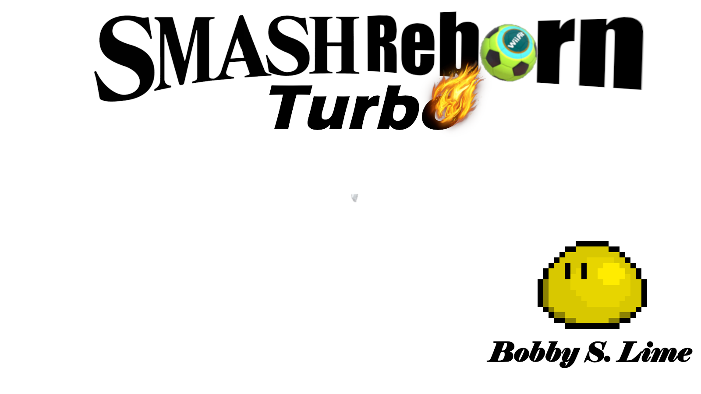

# *Smash Reborn Turbo*

La suite tant attendue de *Smash Reborn* est là pour sa version ultime !

## Description

*Smash Reborn Turbo* est toujours un jeu de plateforme dans lequel deux joueurs s'affrontent. Le joueur gagnant est celui réussissant à expulser l'autre joueur de la plateforme le plus grand nombre de fois. Chaque coup fait augmenter les pourcents de la cible, ce qui augmente la distance à laquelle elle est éjectée à chaque attaque.

## Commandes

**Joueur 1 : Random perso que j'ai trouvé sur le store**

- Gauche : `[Q]`
- Droite : `[D]`
- Sauter : `[V]`
- Descendre : Pas encore ça
- Sprint : Nope
- Attaquer : `[C]`
- Bouclier : `[F]`

**Joueur 2 : Bobby S. Lime**

- Gauche : `[K]`
- Droite : `[M]`
- Sauter : `[Right Shift]`
- Descendre : Toujours pas
- Sprint : `[NopeNope]`
- Attaquer : `[!]`
- Bouclier : `[ù]`

## Instructions pour ajouter un personnage

**Préambule**

Il est conseillé de faire le kit du personnage avant de s'y mettre. Même si Riki peut aider, c'est à toi de programmer le personnage (en t'aidant de ce que j'ai déja fait).

**Animations**

Commencer par faire les animations, de préférence en pixel art, avec le personnage au milieu de change frame (si vous ne voulez pas passer 1000000 ans à offset l'animation pour que tout colle.

Pour l'instant, de par le kit implémenté, les animations à faire sont:
- Idle
- Course
- Chute
- Saut
- Tilt
- Neutral Air
- Bouclier

Exporter les animation sous un format où toutes les frames sont sur le même .PNG

**Implémentation**

Le personnage qu'il faut prendre comme "base" est Bobby. Il est conseillé de le copier coller et de remplacer les animations, la taille des hitbox et tout ce qui doit être changé pour en faire votre perso plutôt que de tout recommencer de 0.

Lorsque vous changez les animations, faites attention aux transitions entre animations, aux durées de sorties et aux requirements sinon ça va pas bien marcher.

Essaye d'organiser un minimum le projet, c'est à dire mettre les sprites dans un dossier au nom du personnage dans le dossier My sprites et de faire la même chose avec le dossier scripts.

**Attaques complexes**

J'ai choisi la voie de la facilité et donc Bobby n'a pas (encore) d'attaques très complexes, mais voici une façon de les faire.

Ceci a été vaguement expliqué dans les commentaires du code du script d'attaque de Bobby, mais je le remets ici.

Pour faire une attaque multi-hit ou qui a un comportement qui évolue au fil des frames écoulées (lag, frames d'armure, etc), faire ça dans la fonction LingeringNomattaque (ex: LingeringTilt) et faire des if/elif/else pour chaque frame. L'avancement des frames de l'attaque est de base géré par la variable nomattaquelengthcounter (ex: tiltlengthcounter). Il n'est donc pas très compliqué d'ajuster les dégats ou le comportement de l'attaque à la frame active. Ca va juste être long. Très long. `o7`.

Pour faire une attaque avec plusieurs hitbox, ce qui permet que la hitbox finales soit plus précise qu'une sphère ou qu'un oval, ajouter des transform nomattackpoint (ex: tiltattackpoint). Il ne suffira alors que de modifier les boucles for dans les fonctions d'attaques pour qu'elles détectent les Collider2D dans toutes les hitbox et boom c'est dans la poche. Il est également possible de séparer les hitbox de cette manière, ce qui rend un tipper possible.

Plusieurs archétypes d'attaques n'ont pas encore été implémentées et je n'y ai pas réflechi à comment les faire, donc si vous voulez faire des projectiles ou des attaques permettant de grab, amusez-vous bien. Si je suis deter, j'ajouterai des attaques de ce type à mon Bobby pour qu'il devienne un vrai petit `Kazuya Mishima`et que la base soit faire pour vous. En attendant, faites-le vous même ! Askip on est jamais mieux servi que de ctte façon là.