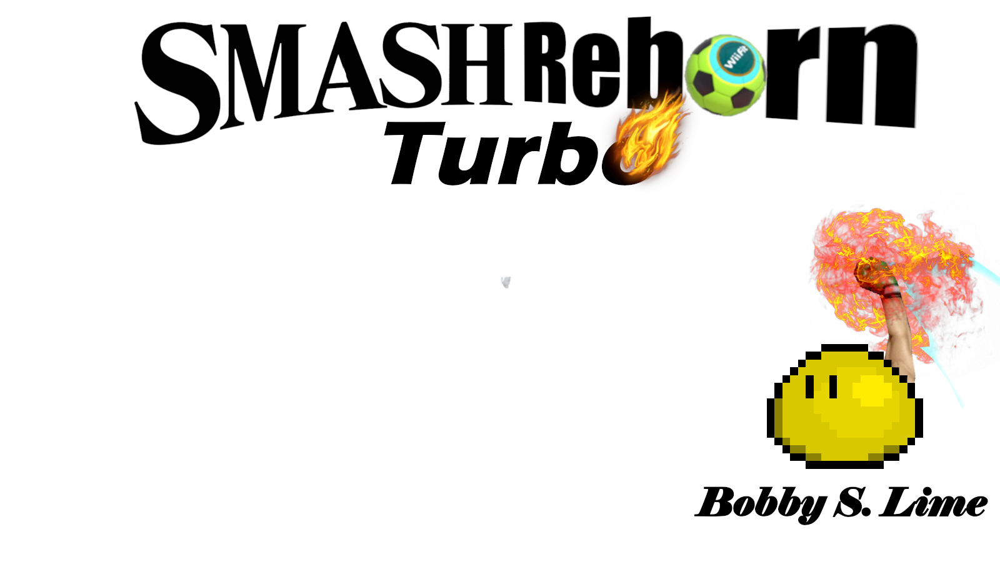

# *Smash Reborn Turbo*

La suite tant attendue de *Smash Reborn* est là pour sa version ultime !

## Description

*Smash Reborn Turbo* est toujours un jeu de plateforme dans lequel deux joueurs s'affrontent. Le joueur gagnant est celui réussissant à expulser l'autre joueur de la plateforme le plus grand nombre de fois. Chaque coup fait augmenter les pourcents de la cible, ce qui augmente la distance à laquelle elle est éjectée à chaque attaque.

## Commandes

**Joueur 1 :**

- Gauche : `[Q]`
- Droite : `[D]`
- Sauter : `[V]`
- Descendre : Pas encore ça
- Sprint : Nope
- Attaquer : `[C]`

**Joueur 2 :**

- Gauche : `[K]`
- Droite : `[M]`
- Sauter : `[Right Shift]`
- Descendre : Toujours pas
- Sprint : `[NopeNope]`
- Attaquer : `[!]`
